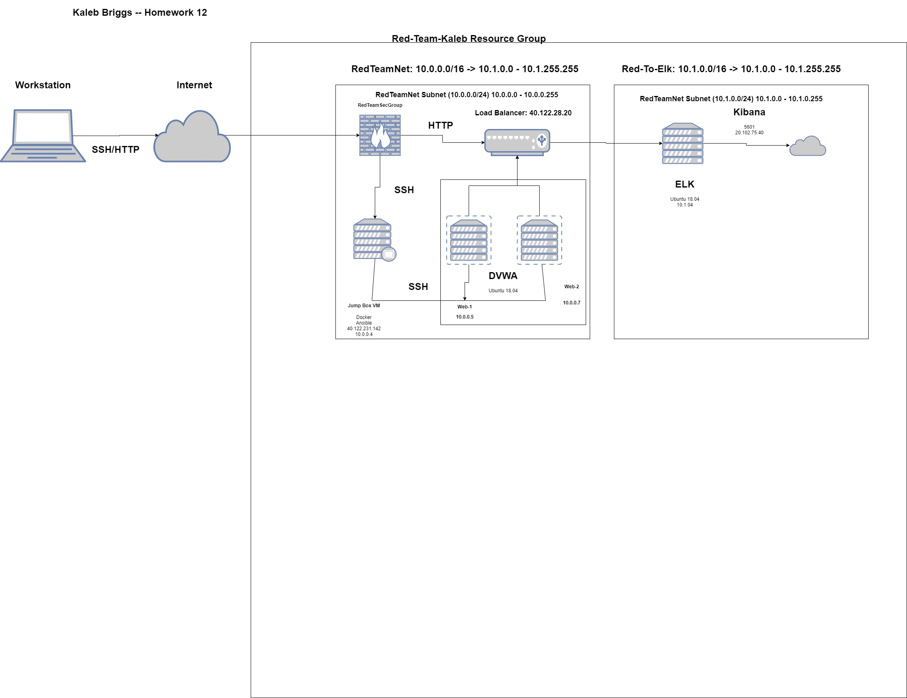

# ELK Server ReadMe

## Automated ELK Stack Deployment

The files in this repository were used to configure the network depicted below.

These files have been tested and used to generate a live ELK deployment on Azure. They can be used to either recreate the entire deployment pictured above. Alternatively, select portions of the .yml file may be used to install only certain pieces of it, such as Filebeat.

  - [Elk-install.yml](https://github.com/kalebbriggs/BriggsProject1/blob/main/Ansible/Elk-Install.yml)
  - [Filebeat-install.yml](https://github.com/kalebbriggs/BriggsProject1/blob/main/Ansible/Filebeat_install.yml)
  - [Metricbeat-install.yml](https://github.com/kalebbriggs/BriggsProject1/blob/main/Ansible/MetricBeat_install.yml)
  - [Docker-install.yml](https://github.com/kalebbriggs/BriggsProject1/blob/main/Ansible/Docker-install.yml)
  - [hosts.yml](https://github.com/kalebbriggs/BriggsProject1/blob/main/Ansible/hosts.yml)

This document contains the following details:
- Description of the Topology
- Access Policies
- ELK Configuration
  - Beats in Use
  - Machines Being Monitored
- How to Use the Ansible Build

### Description of the Topology

The main purpose of this network is to expose a load-balanced and monitored instance of DVWA, the D*mn Vulnerable Web Application.

Load balancing ensures that the application will be highly available, in addition to restricting avvess to the network.

Integrating an ELK server allows users to easily monitor the vulnerable VMs for changes to the event logs and system metrics.

The configuration details of each machine may be found below.
_Note: Use the [Markdown Table Generator](http://www.tablesgenerator.com/markdown_tables) to add/remove values from the table_.

| Name     | Function | IP Address | Operating System |
|----------|----------|------------|------------------|
| Jump Box | Gateway  | 10.0.0.4   | Linux            |
| Web-1    | Webserver| 10.0.0.5   | Linux            |
| Web-2    | Webserver| 10.0.0.7   | Linux            |
| Elk      | Elkserver| 10.1.0.4   | Linux            |

### Access Policies

The machines on the internal network are not exposed to the public Internet. 

Only the Jump Box machine can accept connections from the Internet. Access to this machine is only allowed from the following IP addresses:
- 68.63.249.137 (My local machine IP Address)

Machines within the network can only be accessed by Jump Box via SSH on 10.0.0.4.

A summary of the access policies in place can be found in the table below.

| Name     | Publicly Accessible | Allowed IP Addresses |
|----------|---------------------|----------------------|
| Jump Box | Yes                 | 40.122.231.142       |
| Web-1    | No                  | 10.0.0.4             |
| Web-2    | No                  | 10.0.0.4             |
| ElkServer| No                  | 10.0.0.4             |

### Elk Configuration

Ansible was used to automate configuration of the ELK machine. No configuration was performed manually, which is advantageous because it helps save a lot of time but having the tasks automated with one command as opposed to running different commands or installing software on individual systems. 

The playbook implements the following tasks:
- Installs docker.io
- Installs python3.pip
- Installs the docker module using PIP
- Increases virtual memory and use more memory
- Downloads and launches the ELK container
- Configures to where Docker launches on boot 

The following screenshot displays the result of running `docker ps` after successfully configuring the ELK instance.

### Target Machines & Beats
This ELK server is configured to monitor the following machines:

- Web-1 (10.0.0.5)
- Web-2 (10.0.0.7)

We have installed the following Beats on these machines:

Filebeat
Metricbeat

These Beats allow us to collect the following information from each machine:

- Filebeats can watch for log directories or specific log files
- Metricbeats can be used to monitor the servers by collecting metrics from the system and services running on the server.

### Using the Playbook
In order to use the playbook, you will need to have an Ansible control node already configured. Assuming you have such a control node provisioned: 

SSH into the control node and follow the steps below:
- Copy the Elk_install.yml file to /etc/ansible
- Update the hosts file to include the [Elk] attribute
- Run the playbook, and navigate to http://[your.VM.IP]:5601/app/kibana to check that the installation worked as expected. 

_As a **Bonus**, provide the specific commands the user will need to run to download the playbook, update the files, etc._

If needing to download and run the playbook along with updating the files, the following commands need to be executed:

-SSH into Jump Box
- curl https://github.com/kalebbriggs/BriggsProject1/blob/main/Ansible/Docker-install.yml > /etc/ansible/Docker-install.yml
- nano Docker-install.yml to check hosts and edit playbook if needed
- nano /etc/ansible/hosts to add IPs and [hostnames]
- curl https://github.com/kalebbriggs/BriggsProject1/blob/main/Ansible/Elk-Install.yml >/etc/ansible/Elk-install.yml
- curl https://github.com/kalebbriggs/BriggsProject1/blob/main/Ansible/Filebeat_install.yml > /etc/ansible/Filebeat-install.yml
- curl https://github.com/kalebbriggs/BriggsProject1/blob/main/Ansible/MetricBeat_install.yml > /etc/ansible/Metricbeat-install.yml
- nano the install files to ensure the hostnames matches to the host name in your host file 
- nano the config files to update the ip address in the files to your machines

